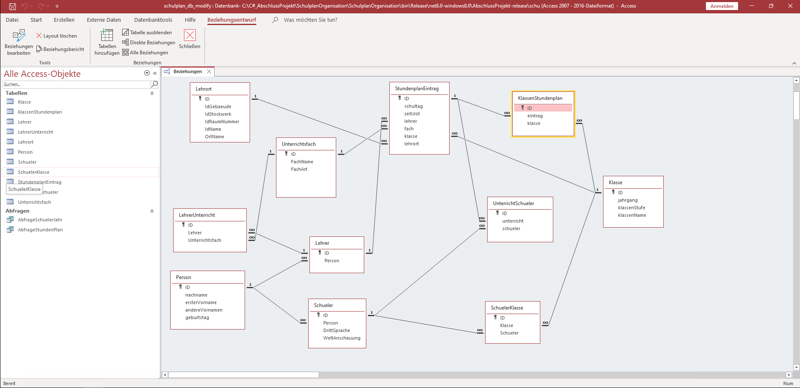
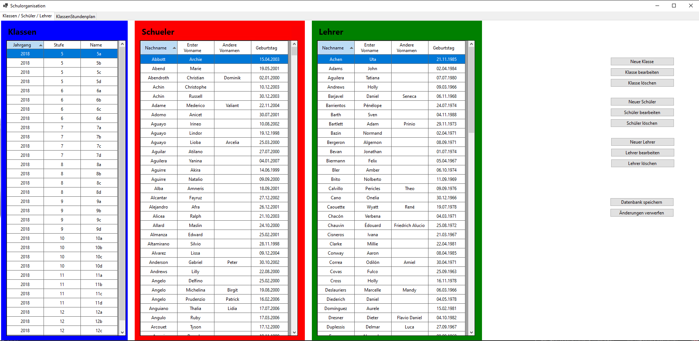
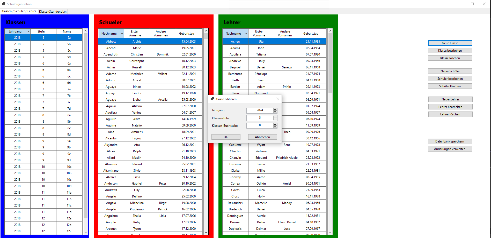
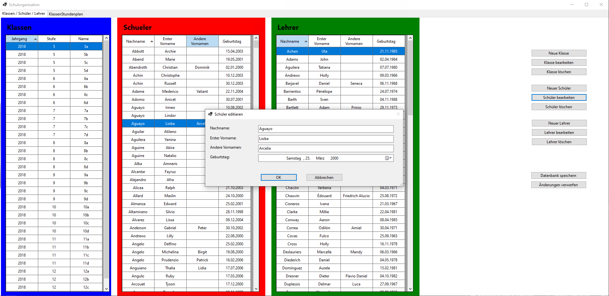
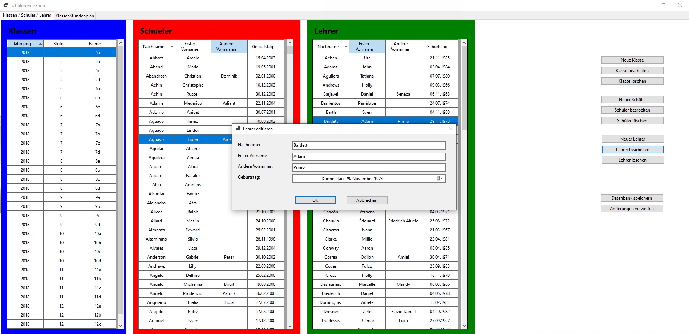
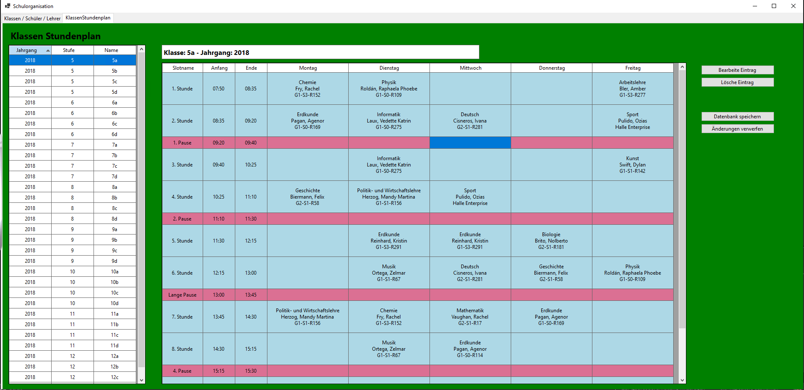
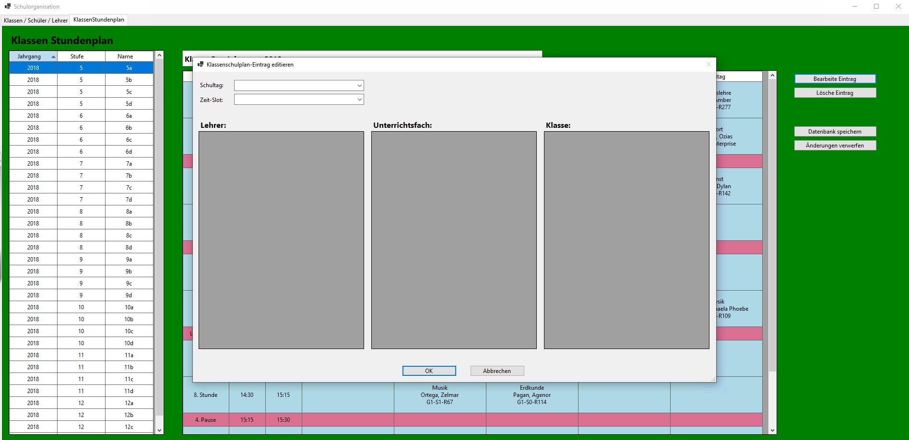

# Abschlussprojekt für ein Visual C# Kurs mit Zertifikat

**Kursanbieter:** alfatraining Bildungszentrum GmbH\
**Kurswebsite:** https://www.alfatraining.de/kurse/weiterbildung-c-entwickler \
**Kurszeitraum:** 2. April 2024 bis 24. Mai 2024\
**Kursteilnehmer:** Christian Alexander Wiesenäcker\
**LinkedIn Profil:** www.linkedin.com/in/christianwiesenaecker

# Das Abschlussprojekt

**Bearbeitungslänge:** 2 Wochen\
**Finalisierung:** nicht fertig implementiert\
**Kurs-Abschluss:** Bestanden mit Zertifikat (100 von 100 Punkten)

## Lizenz: GPL v3
Dieses C# Abschlussprojekt ist unter der GPL v3 lizensiert.

## Aufgabenstellung: Schulverwaltung zur Erstellung von Stundenplänen

Implementierung einer graphischen Schulverwaltung zur Erstellung von Schulstundenplänen.

**Datenbank:**
- Es werden Schüler und Lehrer erfasst und ihnen werden Personendaten zugeordnet.
- Schüler werden verschiedenen Klassen zugeordnet.
- Lehrer bekommen verschiedene Unterrichtsfächer zugeordnet
- Stundenplan-Einträgen
    - haben einen Schultag (Montag bis Freitag) und einen Zeitslot (8:00 - 8:45 / 8:45 - 9:30 / 9:45 - 10:30 / ...)
    - haben einen Lehrer, ein Unterrichtsfach, einen Lehrort sowie optional eine Klasse zugeordnet
- Zuordnung von Stundenplan-Einträgen zu Klassen und zu einzelnen Schülern,
 um Klassenstundenpläne sowie spezifische Schüler-Stundenpläne mit zusätzlichen Wahlfächern abzubilden

**Die Anwendung**
Zeigt die vorhandenen Klassen / Schüler / Lehrer an und ermöglicht das Hinzufügen / Editieren / Löschen von Einträgen.
Zeigt die Klassenstundenpläne aus einer vorgefüllten Datenbank an (die Editierung ist derzeit nicht möglich, aber die Benutzeroberfläche wurde angefangen)

**Unit Tests**
Es wurden Unit-Tests geschrieben, die dazu genutzt wurden, die benutzte Datenbank mit plausiblen Dummy-Daten zu füllen.

## Screenshots
 \
 \
 \
 \
 \
 \

 \

